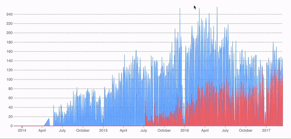

## Simple Demo app using React and D3.js

D3.js is a very popular library to display charts and various other forms of graphics.
You can find many examples on how D3 gets integrated with SPA applications like React. Typical implementation would be:

1. React renders DOM elements including a empty svg tag
2. D3 gets access to that svg tag through React Ref
3. then D3 creates svg elements like path, line, and others based on the given data, which happens in one of React lifecycles (probably useEffect or componentDidMount)

While this works for simple cases, problems can occur when underlying data is dynamic because in this setup D3 is responsible for creating DOM elements not React (telling D3 to create all the svg elements from scratch whenever data changes can be costly)

This repo shows how D3 is being used for vector related calculations **only** and React is being used for DOM manipulation.

Note: this project was bootstrapped with [Create React App](https://github.com/facebook/create-react-app).
Run `npm install` & `npm start` commands to run the app.
